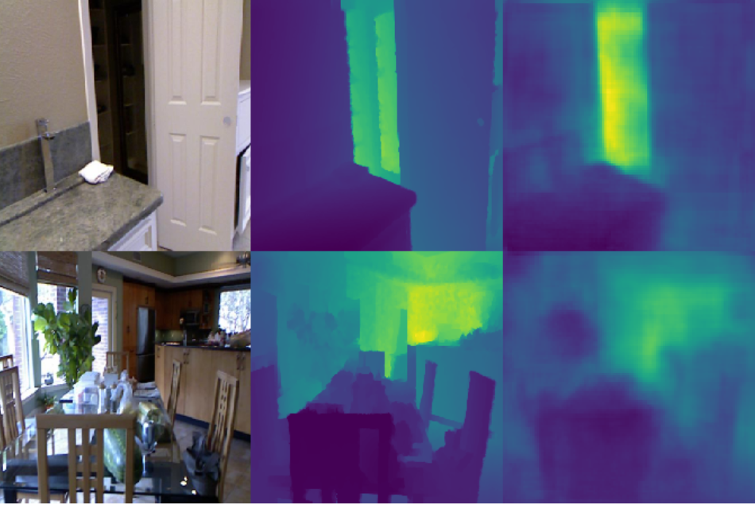

# Towards Improving Monocular Depth Estimation for Mobile Devices

We propose a new method for fast and accurate monocular depth estimation for embedded systems. Our objective was to improve the [FastDepth](http://fastdepth.mit.edu/) model, which achieves state-of-the-art per-formance for mobile applications. To do this, different loss functions were tested for training the model and more advanced light-weight CNNs were used as encoders. Even though switching from the default L2 to the BerHu loss function had as a result only a minor improvement in the quality of the generated depth maps, we managed to enhance significantly the performance of Fast-Depth, by using an [EfficientNet](https://arxiv.org/pdf/1905.11946.pdf) based CNN as the encoder. These changes had but a minuscule effect on the model’s size and latency, which is why we argue that our approach is an improvement for mobile applications

## FastDepth Depth-maps with our Encoder:

***Figure:** 1st column: RGB input image, 2nd column: ground truth depth map, 3rd column: generated depth map*

|                      |      Size| No. Params | Avg. Latency| RMSE |
|----------------------|------    |------      | ------      |------|
|Original FastDepth    |31MB    |4M     | 9msecs     |796|
|EfficientDepth (ours) |40MB    |6.5M      | 23msecs      | 678|

## Using our model to generate 3D images with [3d photo inpainting](https://github.com/vt-vl-lab/3d-photo-inpainting)

<video width="320" height="240" controls>
  <source src="ReDWeb_dolly_zoom_in.mp4" type="video/mp4">
</video>

<figure class="video_container">
  <iframe src="https://github.com/CharalambosIoannou/Machine-Learning-Practical-Coursework/blob/main/ReDWeb_dolly_zoom_in.mp4" frameborder="0" allowfullscreen="true"> </iframe>
</figure>
